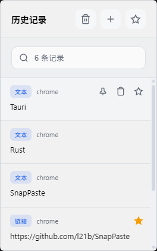

# SnapPaste

A lightweight clipboard history tool built with Rust + Tauri + Svelte, quick access, fast search, and instant paste.

  
  
  

## Features

- Global hotkey support (default `Ctrl+Shift+V`)
- Dual-view: History & Favorites, with search support
- Pin, favorite, delete, and clear records
- Favorites import/export (JSON)
- Window appears at the mouse position
- Light/Dark theme support

## Current Version Notes

- This release focuses on text clipboard functionality. Image recording and image pasting are not yet available.

## Tech Stack

- Rust
- Tauri 2.x
- Svelte 5
- SQLite (rusqlite)
- arboard
- enigo
- clipboard-master

